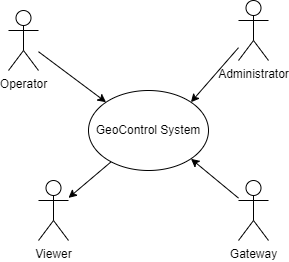
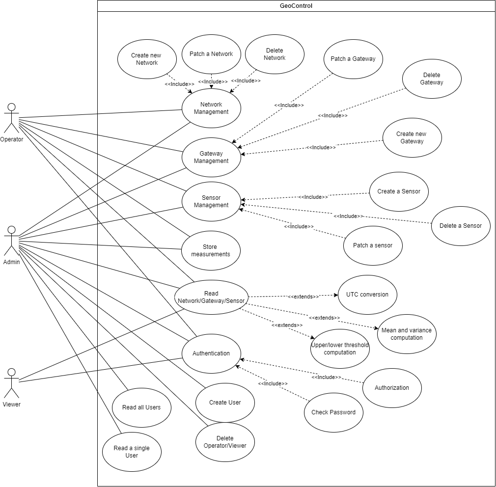
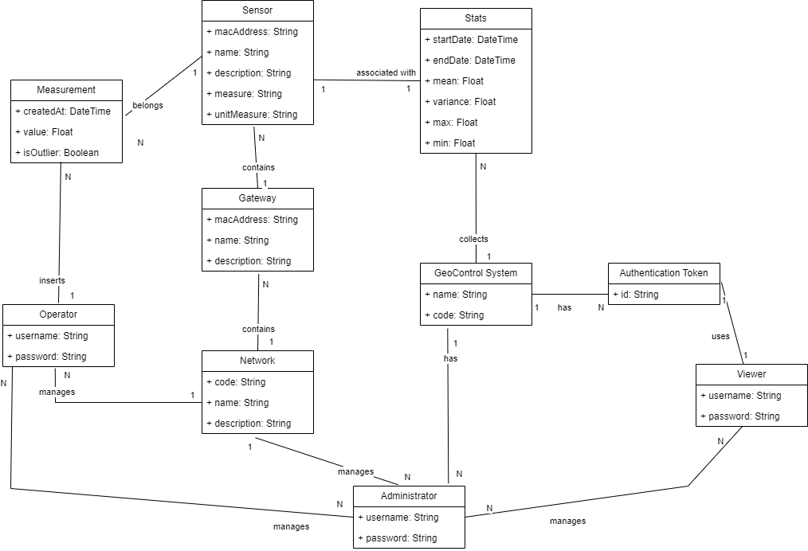
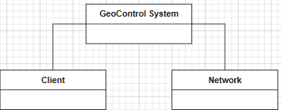
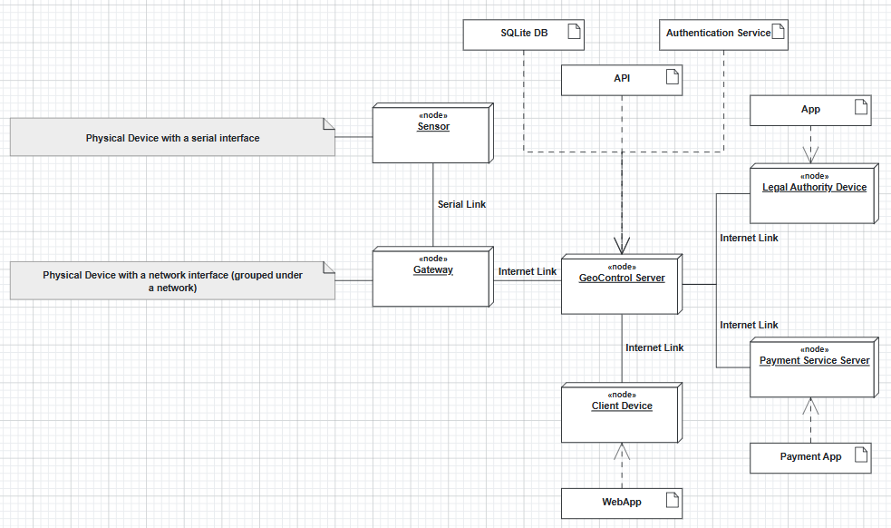

# Requirements Document - GeoControl

Date: 18/04/2025

Version: V1 - description of Geocontrol as described in the swagger

| Version number | Change |
| :------------: | :----: |
|        1.1        |        |

# Contents

- [Requirements Document - GeoControl](#requirements-document---geocontrol)
- [Contents](#contents)
- [Informal description](#informal-description)
- [Business model](#business-model)
- [Stakeholders](#stakeholders)
- [Context Diagram and interfaces](#context-diagram-and-interfaces)
  - [Context Diagram](#context-diagram)
  - [Interfaces](#interfaces)
- [Stories and personas](#stories-and-personas)
  - [Personas](#personas)
  - [Stories](#stories)
- [Functional and non functional requirements](#functional-and-non-functional-requirements)
  - [Functional Requirements](#functional-requirements)
  - [Non Functional Requirements](#non-functional-requirements)
- [Use case diagram and use cases](#use-case-diagram-and-use-cases)
  - [Use Case Diagram](#use-case-diagram)
  - [Use Case 1: Authentication](#use-case-1-authentication)
  - [Use Case 2: Admin User Management](#use-case-2-admin-user-management)
  - [Use Case 3: System Management](#use-case-3-system-management)
  - [Use Case 4: Measurements](#use-case-4-measurements)
- [Glossary](#glossary)
- [System Design](#system-design)
- [Deployment Diagram](#deployment-diagram)
  - [Nodes and Devices](#nodes-and-devices)
  - [Software & Interfaces](#software--interfaces)
  - [Communication Links](#communication-links)

# Informal description

GeoControl is a software system designed for monitoring physical and environmental variables in various contexts: from hydrogeological analyses of mountain areas to the surveillance of historical buildings, and even the control of internal parameters (such as temperature or lighting) in residential or working environments.

# Business Model

## Key Partners

- Suppliers for sensors and for network dividers

- Host Provider

- Payment System

**Purpose:** 

- to leverage partnership for efficiency, cost reduction and resource sharing

- outsourcing

## Key Activities

- API Management

- Gateway administration, maintenance

- Network administration, maintenance

- Marketing

- Network Design

- Data Collecting

- R&D

## Key Resources

### Physical

- Sensors and Network Infrastructure

- Website

### Intellectual

- Client Database

- Know-how (data collecting, firmware dev, etc...)

### Human

- Employee

- Electronic Engineers

- Computer Engineers

- Salesforce

- Network Designers

- Customer Service (CRM)

- Operators

- Administrators

### Financial

- Regional Funds

- Investors

- Reserves (Emergency Funds)

- Cash-flow

- Lines of Credits

## Value Propositions

- Cost efficiency

- Time Efficiency

- Reliability of data sent

- Receiving data in real time

- 24/7 On Demand Data

- High Quality Data

- Easy to use/implement the service

- Security of data and access

## Customer Relationships

- Self-Service [Website]

- Personal Assistance [Mail-Service]

## Channels

- Third Parties Distributors

- Website

## Customer Segments

- Associations (e.g. Union of Mountain Communities of the Piedmont)

- Public or private entities requiring continuous monitoring

## Cost Structure

### Fixed Cost

- Cost of Employees, Operators and Administrators

- Cost of CRM

- Cost of Infrastructure (Maintenance)

- Cost of Database/Servers Infrastructure

- Cost of R&D

- Cost of Payment Processing Fees

- Licensing

### Variable Cost

- Cost of Sensors

- Cost of Gateways

- Cost of Marketing (e.g. ADVs)

## Revenue Streams

- Subscription fees for continuous monitoring based on the context

- Advanced reporting and analytics

- Custom monitoring solutions for preserving historical sites

# Stakeholders

| Stakeholder name         | Description                                   |
| :----------------------: | :------------------------------------------: |
| Administrator            | Manages users, networks, gateways and sensors |
| Operator                 | Operates and maintains the system            |
| Viewer                   | Public/Private entities using the service    |
| Payment Service          | Handles payments for the service             |
| Investors                | Monitor system performance and reports       |
| Legal Authorities        | Ensures compliance with regulations          |
| CEO                      | Oversees the system's overall performance    |
| Suppliers of Sensors and Gateways | Provides hardware for the system         |

# Context Diagram and interfaces

## Context Diagram

**GeoControl System**: interacts with **Administrator**, **Operator**, **Viewer**, and **Gateway** via API.

We decided to consider **Gateways** as Actors because they interact directly with the API for managing their configuration and transmitting sensor data. This is evident from the endpoints defined in the Swagger documentation.

On the other hand, we still do not consider **Sensors** as Actors because they do not directly interact with the API. Sensors are managed indirectly through Gateways, which act as intermediaries for transmitting sensor data to the GeoControl System.

Additionally, we decided that **Network** (the logical group of Gateways connected) is part of the System (look at the System Design).

## Interfaces

|   Actor   | Logical Interface | Physical Interface |
| :-------: | :---------------: | :----------------: |
| Administrator | REST API for user management, topology management and measurement operations | Client device (PC, tablet, or smartphone) connected via the internet |
| Viewer | REST API for read-only access to networks, gateways, sensors and measurements | Client device (PC, tablet, or smartphone) connected via the internet |
| Operator | REST API for managing networks, gateways, sensors and inserting measurements | Client device (PC, tablet, or smartphone) connected via the internet |
| Gateway | REST API for transmitting sensor data | Network connection (Ethernet/Wi-Fi) to the GeoControl system |

# Stories and personas

## Personas

### Admin

- **Purpose:** user and network management. She has **access to full resources** (db, logs, etc.)

- **Frustrations:** unauthorized access, data loss, missing audit trail

- **Technicality:** high, she knows how to work with APIs, security and distributed systems

### Operator

- **Purpose:** network, gateway and sensor management. She can't access to user-related functionalities

- **Frustrations:** synchronization errors, difficulty in replacing devices (e.g. sensors)

- **Technicality:** medium-high, she knows how to handle sensors and how to interact with the system through a GUI and scripts

### Viewer

It's the end user (for those who intend to use the service). It can be a private person (e.g. data analyst) or an entity which requires continuous monitoring of physical parameters.

- **Purpose:** monitor environmental data to identify trends, anomalies or alarms. She doesn't have access to user information

- **Frustrations:** difficulty on finding data in a coherent way, missing advanced tools

- **Technicality:** Low, she just need to work with data retrieved

## Stories

### Admin

- As an Admin, I want to retrieve, create and delete users with different roles in order to handle resource access

- As an Admin, I want to see all existent users, so to handle system access

- As an Admin, I want to see the status of the Network, so I know how to report problems, which parts need maintenance etc.

### Operator

- As an Operator, I want to retrieve/create/modify/delete a Gateway, so I can organize better the lower levels

- As an Operator, I want to replace a sensor with another one, so I can maintain data continuity

- As an Operator, I want to have the possibility to detect problem for Gateways and sensors

- As an Operator, I want to access to network data, so I can perform updates and maintenance

- As an Operator, I want to insert a new measurement

### Viewer

- As a viewer, I want to see the list of network and devices, so I can have an overview of the system

- As a viewer, I want to retrieve stats, so I can see see the average and variance of the measures produced by a sensor

- As a viewer, I want to see measurements

- As a viewer, I want to see outlier measures, so I can focus on alarms or anomalies

# Functional and non functional requirements

## Functional Requirements

| ID    | Description |
|-------|-------------|
| **FR1** | **Authorization and Authentication** |
| FR1.1 | The system should let users log in with a correct username and password. |
| FR1.2 | After login, the system should return a bearer token to be used in subsequent requests. |
| FR1.3 | The system should support three user roles: Admin, Operator, and Viewer. |
| **FR2** | **User Management (Admin only)** |
| FR2.1 | The system should allow Admins to retrieve a list of all users. |
| FR2.2 | The system should allow Admins to create a new user. |
| FR2.3 | The system should allow Admins to retrieve a specific user's details. |
| FR2.4 | The system should allow Admins to delete a user. |
| **FR3** | **Network Management** |
| FR3.1 | The system should allow all roles to view the list of networks. |
| FR3.2 | The system should allow Admins and Operators to create a new network. |
| FR3.3 | The system should allow all roles to view a specific network. |
| FR3.4 | The system should allow Admins and Operators to update a network. |
| FR3.5 | The system should allow Admins and Operators to delete a network. |
| **FR4** | **Gateway Management** |
| FR4.1 | The system should allow all roles to view gateways of a specific network. |
| FR4.2 | The system should allow Admins and Operators to create a new gateway in a network. |
| FR4.3 | The system should allow all roles to view a specific gateway. |
| FR4.4 | The system should allow Admins and Operators to update a gateway. |
| FR4.5 | The system should allow Admins and Operators to delete a gateway. |
| **FR5** | **Sensor Management** |
| FR5.1 | The system should allow all roles to view sensors of a specific gateway. |
| FR5.2 | The system should allow Admins and Operators to add a new sensor to a gateway. |
| FR5.3 | The system should allow all roles to view a specific sensor. |
| FR5.4 | The system should allow Admins and Operators to update a sensor. |
| FR5.5 | The system should allow Admins and Operators to delete a sensor. |
| **FR6** | **Measurement Collection and Storage** |
| FR6.1 | The system should allow Admins and Operators to store measurements for a sensor. |
| FR6.2 | The system should allow all roles to retrieve measurements for a sensor. |
| FR6.3 | The system should store all timestamps in UTC and return them in UTC format. |
| **FR7** | **Statistics and Outlier Detection** |
| FR7.1 | The system should allow all roles to retrieve statistics for a sensor. |
| FR7.2 | The system should allow all roles to retrieve outlier data for a sensor. |
| FR7.3 | The system should allow all roles to retrieve network-wide statistics. |
| FR7.4 | The system should allow all roles to retrieve network-wide outliers. |
| FR7.5 | Outliers should be detected using: `upper = μ + 2σ`, `lower = μ - 2σ`, where μ = mean and σ = standard deviation. |

## Non Functional Requirements

|  ID   |     Type      | Description | Refers to |
|:-----:|:-------------:|-------------|-----------|
| NFR1  | **Usability** | The API should use clear and consistent RESTful patterns for all endpoints. | All FRs |
| NFR2  | **Usability** | All responses must use JSON format with meaningful status codes and error messages. | All FRs |
| NFR3 | **Security** | The token should be included in the `Authorization` header in all API requests. | FR1.1, FR1.2 |
| NFR4  | **Portability** | Each measurement should include a numeric value and an ISO 8601 timestamp converted to UTC. | FR6.3 |
| NFR5 | **Reliability** | The system must ensure that no more than six measurements are missed per year to maintain 99.9% uptime for continuous monitoring. | FR6, FR7 |
| NFR8  | **Security** | User roles must be strictly enforced for access control (Admin, Operator, Viewer). | FR1.3, FR2, FR3, FR4, FR5, FR6 |
| NFR9 | **Safety** | Only Admins and Operators should be allowed to modify topology and measurement data to avoid accidental changes. | FR2–FR6 |

# Use case diagram and use cases

## Use Case Diagram

###

### Use Case 1: Authentication

| Use Case                  | Authentication                                                       |
| ------------------------- | -------------------------------------------------------------------- |
| **ID**                    | UC1                                                              |
| **Actors**                | Admin, Operator, Viewer                                              |
| **Preconditions**         |                                                                      |
| **Postconditions**        | User is authenticated and authorized with a bearer token             |
| **Nominal Scenario**      | The user (Admin, Operator, or Viewer) sends username and password.   |
| **Variants**              | None                                                                 |
| **Alternative Sequences** | - **Invalid username/password**: The system sends an error response. |
|                           | - **Token expired**: The system sends an error response.             |

#### Nominal Scenario

**Precondition:** _none_

| Step | Actor  | Description                                |
| ---- | ------ | ------------------------------------------ |
| 1    | User   | Opens the service                          |
| 2    | System | Asks for username and password             |
| 3    | User   | Inserts username and password              |
| 4    | System | Checks if credentials are correct (**Ok**) |
| 5    | System | Recognizes the user role                   |
| 6    | System | Sends an authorization token               |

**Post-condition:** User is authenticated and authorized.

#### Exceptional Scenario 1: invalid username/password

**Precondition:** _none_

| Step | Actor  | Description                                                 |
| ---- | ------ | ----------------------------------------------------------- |
| 1    | User   | Opens the service                                           |
| 2    | System | Asks for username and password                              |
| 3    | User   | Inserts username and password                               |
| 4    | System | Checks if credentials are correct (**Error**)               |
| 5    | System | Sends an error response (_“ Invalid username or password”_) |

**Postcondition:** Authentication denied.

#### Exceptional Scenario 2: Token expired

**Precondition:** user is authenticated

| Step | Actor  | Description                                  |
| ---- | ------ | -------------------------------------------- |
| 1    | User   | Makes a request                              |
| 2    | System | Checks if token is still valid (**Error**)   |
| 3    | System | Returns an error response (_“Unauthorized”_) |

**Post-condition:** User is no more authenticated and authorized

### Use Case 2: Admin User Management

| Use Case                  | Admin User Management                                                                                                                |
| ------------------------- | ------------------------------------------------------------------------------------------------------------------------------------ |
| **ID**                    | UC2                                                                                                                              |
| **Actors**                | Admin                                                                                                                                |
| **Preconditions**         | - User is an Admin                                                                                                                   |
|                           | - Admin is authenticated                                                                                                             |
|                           | - Admin is authorized                                                                                                                |
| **Postconditions**        | - User management operation is executed                                                                                              |
| **Sequence of Events**    | 1. Admin makes a user management request.                                                                                            |
|                           | 2. There are 4 types of requests:                                                                                                    |
|                           | - **Create**: Admin sends username, password, and type; the system creates a new user.                                               |
|                           | - **ReadAll**: The system returns all users.                                                                                         |
|                           | - **Read**: The system returns a user based on the username provided by the Admin.                                                   |
|                           | - **Delete**: The system deletes a user based on the username provided by the Admin.                                                 |
|                           | 3. The system checks if the operation is valid.                                                                                      |
|                           | 4. The system returns a response to the Admin.                                                                                       |
| **Alternative Sequences** | - **User is not Admin**: If the request is made by a non-Admin user, the system sends an error response.                             |
|                           | - **Username already used (Create operation)**: The system sends an error response indicating the username is already in use.        |
|                           | - **User does not exist (Read/Delete operation)**: The system sends an error response indicating the specified user does not exist.  |
|                           | - **Invalid information**: The system sends an error response indicating the entered data is not compliant with the system policies. |

####

#### Nominal Scenario

**Precondition:** Admin is authenticated and Authorized

| Step | Actor  | Description                                                  |
| ---- | ------ | ------------------------------------------------------------ |
| 1    | Admin  | Enters the GeoControl service and makes a user request:      |
|      |        | - **Create**: Creates a new user (username, password, type). |
|      |        | - **ReadAll**: Reads all registered users.                   |
|      |        | - **Read**: Reads a user by sending the username.            |
|      |        | - **Delete**: Deletes a user by sending the username.        |
| 2    | System | Checks the authentication token (**Ok**).                    |
| 3    | System | Checks if the user is actually an Admin (**Ok**).            |
| 4    | System | Checks if the data sent by the Admin are valid (**Ok**)      |
| 5    | System | Checks if the data sent are correct (**Ok**)                 |
| 6    | System | Returns a response.                                          |

**Postcondition:** Operation executed successfully.

#### Exceptional Scenario 1: A non-Admin user makes a User management request

**Precondition:** User is not Admin but authenticated.

| Step | Actor  | Description                                                           |
| ---- | ------ | --------------------------------------------------------------------- |
| 1    | User   | requests an user management request (Create, Read, ReadAll or Delete) |
| 2    | System | Checks if the User is authenticated (**Ok**)                          |
| 3    | System | Checks if the User is Admin (**Error**)                               |
| 4    | System | Returns an error response (_“Insufficient rights”_)                   |

**Postcondition:** Operation denied.

#### Exceptional Scenario 2: Creation user with an username which is already used

**Precondition:** Admin is authenticated and authorized.

| Step | Actor  | Description                                                         |
| ---- | ------ | ------------------------------------------------------------------- |
| 1    | Admin  | Requests to create a new user and sends username, password and type |
| 2    | System | Checks if the username does not exist (**Error**)                   |
| 3    | System | Returns an error response (_“This username already in use”_)        |

**Postcondition:** Operation denied.

#### Exceptional Scenario 3: Create an user without valid input data

**Precondition:** Admin is authenticated and authorized.

| Step | Actor  | Description                                                      |
| ---- | ------ | ---------------------------------------------------------------- |
| 1    | Admin  | Requests to create an user and sends username, password and type |
| 2    | System | Checks if the username does not exist (**Ok**)                   |
| 3    | System | Checks if data is valid (**Error**)                              |
| 4    | System | Returns an error Response (_“Invalid Input Data”_)               |

**Postcondition:** Operation denied.

#### Exceptional Scenario 4: Read/Delete a non-existing User

**Precondition:** Admin is authenticated and authorized.

| Step | Actor  | Description                                                 |
| ---- | ------ | ----------------------------------------------------------- |
| 1    | Admin  | Requests to read/delete an user and specifies user username |
| 2    | System | Checks if the username exists (**Error**)                   |
| 3    | System | Returns an error response (_“Internal Server Error”_)       |

**Postcondition:** Operation denied.

### Use Case 3: System Management

| Use Case                  | System Management                                                                                                                                                                                             |
| ------------------------- | ------------------------------------------------------------------------------------------------------------------------------------------------------------------------------------------------------------- |
| **ID**                    | UC3                                                                                                                                                                                                           |
| **Actors**                | Admin, Operator, Viewer                                                                                                                                                                                       |
| **Preconditions**         | - Operator, Admin or Viewer must be authenticated and authorized                                                                                                                                              |
| **Sequence of Events**    | 1. Admin/Operator/Viewer makes a Network/Gateway/Sensor request.                                                                                                                                              |
|                           | 2. There are 5 types of requests:                                                                                                                                                                             |
|                           | - **Create**: Admin/Operator sends data to create a Network/Gateway/Sensor.                                                                                                                                   |
|                           | - **Read**: Admin/Operator/Viewer can read a Network/Gateway/Sensor by sending the identifier (code for Networks, MAC address for Gateways and Sensors).                                                      |
|                           | - **ReadAll**: Admin/Operator/Viewer can read all registered Network/Gateway/Sensors.                                                                                                                         |
|                           | - **Patch**: Admin/Operator sends data to modify an existing Network/Gateway/Sensor.                                                                                                                          |
|                           | - **Delete**: Admin/Operator sends data to delete an existing Network/Gateway/Sensor.                                                                                                                         |
|                           | 3. The system checks if the operation is valid.                                                                                                                                                               |
|                           | 4. The system returns a response to Admin/Operator.                                                                                                                                                           |
| **Alternative Sequences** | - **User is not Admin or Operator**: If the request is made by a Viewer, the system sends an error response.                                                                                                  |
|                           | - **Name or MAC address already used (Create operation)**: The system sends an error response reporting the name (or MAC address for Gateways and Sensors) is already used by another Network/Gateway/Sensor. |
|                           | - **Name or MAC address does not exist (Patch/Delete operation)**: The system sends an error response reporting the specified Network/Gateway/Sensor does not exist.                                          |
|                           | - **Invalid information**: The system sends an error response reporting the entered data is not compliant with the type of data requested.                                                                    |

####

#### Nominal Scenario

**Precondition:** Admin/Operator/Viewer is authenticated and authorized.

| Step | Actor                 | Description                                                                                                                                             |
| ---- | --------------------- | ------------------------------------------------------------------------------------------------------------------------------------------------------- |
| 1    | Admin/Operator/Viewer | Enters the GeoControl service and makes a system request:                                                                                               |
|      |                       | - **Create** (Admin/Operator): Sends data to create a Network/Gateway/Sensor.                                                                           |
|      |                       | - **Read** (Admin/Operator/Viewer): Reads a Network/Gateway/Sensor by sending the identifier (code for Networks, MAC address for Gateways and Sensors). |
|      |                       | - **ReadAll** (Admin/Operator/Viewer): Reads all registered Network/Gateway/Sensors.                                                                    |
|      |                       | - **Patch** (Admin/Operator): Sends data to modify an existing Network/Gateway/Sensor.                                                                  |
|      |                       | - **Delete** (Admin/Operator): Sends data to delete an existing Network/Gateway/Sensor.                                                                 |
| 2    | System                | Checks the authentication token (**Ok**).                                                                                                               |
| 3    | System                | Checks if the User has rights to perform the operation (**Ok**).                                                                                        |
| 4    | System                | Checks if the data sent by the User are valid (**Ok**).                                                                                                 |
| 5    | System                | Checks if the data sent are correct (**Ok**).                                                                                                           |
| 6    | System                | Returns a response.                                                                                                                                     |

**Postcondition:** operation executed successfully.

#### Exceptional Scenario 1: Viewer tries to create/patch/delete a Network/Gateway/Sensor

**Precondition:** Viewer is authenticated and authorized.

| Step | Actor  | Description                                                     |
| ---- | ------ | --------------------------------------------------------------- |
| 1    | User   | Requests an system management request (Create, Patch or Delete) |
| 2    | System | Checks if the User is Admin or Operator (**Error**)             |
| 3    | System | Returns an error response (_“Insufficient rights”_)             |

**Postcondition:** Operation denied.

#### Exceptional Scenario 2: Creation of Network/Gateway/Sensor with an id already used

**Precondition:** Admin/Operator is authenticated and authorized.

| Step | Actor          | Description                                                            |
| ---- | -------------- | ---------------------------------------------------------------------- |
| 1    | Admin/Operator | Sends a creation request and data:                                     |
|      |                | - **Network**: code (id), name, and description.                       |
|      |                | - **Gateway**: MAC address (id), name, and description.                |
|      |                | - **Sensor**: MAC address (id), name, description, variable, and unit. |
| 2    | System         | Checks if the id does not exist (**Error**).                           |
| 3    | System         | Returns a response (_“Network/Gateway/Sensor already used”_).          |

**Postcondition:** operation denied.

#### Exceptional Scenario 3: Read/Patch/Delete of a non-existing Network/Gateway/Sensor

**Precondition:** Admin/Operator/Viewer is authenticated and authorized.

| Step | Actor                 | Description                                                           |
| ---- | --------------------- | --------------------------------------------------------------------- |
| 1    | Admin/Operator/Viewer | Sends a request with the id and new data (if the request is Patch):   |
|      |                       | - **Network**: code (id), name and description.                       |
|      |                       | - **Gateway**: MAC address (id), name and description.                |
|      |                       | - **Sensor**: MAC address (id), name, description, variable and unit. |
| 2    | System                | Checks if the id exists (**Error**).                                  |
| 3    | System                | Returns a response (_“Network/Gateway/Sensor not found”_).            |

**Postcondition:** operation denied.

#### Exceptional Scenario 4: Read/ReadAll request from a non-authorized user

**Precondition:** User not authorized.

| Step | Actor  | Description                                            |
| ---- | ------ | ------------------------------------------------------ |
| 1    | User   | Sends a read/readAll request of Network/Gateway/Sensor |
| 2    | System | Checks if User is authenticated (**Error**)            |
| 3    | System | Returns an error response (_“Unauthorized”_)           |

**Postcondition:** Operation denied.

### Use Case 4: Measurements

| Use Case                  | Measurements                                                                                             |
| ------------------------- | -------------------------------------------------------------------------------------------------------- |
| **ID**                    | UC4                                                                                                      |
| **Actors**                | Admin, Operator, Viewer                                                                                  |
| **Preconditions**         | Admin/Operator/Viewer is authenticated and authorized                                                    |
| **Sequence of Events**    | 1. Admin/Operator/Viewer enters to GeoControl service and makes a measurement request:                   |
|                           | - **Measurements** of a set of sensors in a specific network or for specific sensors.                    |
|                           | - **Stats** of a set of sensors in a specific network or for specific sensors.                           |
|                           | - **Outliers** of a set of sensors in a specific network or for specific sensors.                        |
|                           | 2. The system checks if the operation is valid.                                                          |
|                           | 3. The system returns a response to Admin/Operator/Viewer.                                               |
| **Alternative Sequences** | - **Insufficient rights**: Viewer tries to insert a measurement.                                         |
|                           | - **Network/Gateway/Sensor not found**: The specified Network/Gateway/Sensor by the user does not exist. |

#### Nominal Scenario

**Precondition:** Admin/Operator/Viewer is authenticated and authorized.

| Step | Actor                 | Description                                                                                                                                  |
| ---- | --------------------- | -------------------------------------------------------------------------------------------------------------------------------------------- |
| 1    | Admin/Operator/Viewer | Enters the GeoControl service and makes a measurement request:                                                                               |
|      |                       | - **Read** (also for Viewer) **or Insert** (not for Viewer): Measurements of a set of sensors in a specific network or for specific sensors. |
|      |                       | - **Read Stats**: Stats of a set of sensors in a specific network or for specific sensors.                                                   |
|      |                       | - **Read Outliers**: Outliers of a set of sensors in a specific network or for specific sensors.                                             |
| 2    | System                | Checks the authentication token (**Ok**).                                                                                                    |
| 3    | System                | Checks if the User has rights to perform the operation (**Ok**).                                                                             |
| 4    | System                | Checks if the data sent by the User are valid (**Ok**).                                                                                      |
| 5    | System                | Checks if the data sent are correct (**Ok**).                                                                                                |
| 6    | System                | Returns a response.                                                                                                                          |

**Postcondition:** operation executed successfully.

#### Exceptional Scenario 1: Viewer tries to insert a new measurement

**Precondition:** Viewer is authenticated and authorized.

| Step | Actor  | Description                                                |
| ---- | ------ | ---------------------------------------------------------- |
| 1    | User   | Requests to insert a new measurement for a specific sensor |
| 2    | System | Checks if the User is Admin or Operator (**Error**)        |
| 3    | System | Returns an error response (_“Insufficient rights”_)        |

**Postcondition:** Operation denied.

#### Exceptional Scenario 2: Network/Gateway/Sensor not found

**Precondition:** Admin/Operator/Viewer is authenticated and authorized.

| Step | Actor                 | Description                                                                                           |
| ---- | --------------------- | ----------------------------------------------------------------------------------------------------- |
| 1    | Admin/Operator/Viewer | Requests to read (also for viewer) or insert (not for viewer) a new measurement for a specific sensor |
| 2    | System                | Checks the authentication token (**Ok**)                                                              |
| 3    | System                | Checks if the User has rights to ask the operation (**Ok**)                                           |
| 4    | System                | Checks if the data sent by the User are valid (**Ok**)                                                |
| 5    | System                | Checks if the data sent are correct (**Error**)                                                       |
| 6    | System                | Send an error request (_“Network/Gateway/Sensor not found”_)                                          |

**Postcondition:** Operation denied.

# Glossary

- **Sensor**
  - Attributes: macAddress, name, description, measure, unitMeasure
  - Contains multiple `Measurement` entries
  - Belongs to one `Gateway`
  - Associated with one `Stats`

- **Measurement**
  - Attributes: createdAt, value, isOutlier
  - Belongs to one `Sensor`
  - Inserted by one `Operator`

- **Stats**
  - Attributes: startDate, endDate, mean, variance, max, min
  - Associated with one `Sensor`
  - Collected by one `GeoControl System`

- **Gateway**
  - Attributes: macAddress, name, description
  - Contains multiple `Sensor` devices
  - Belongs to one `Network`

- **Network**
  - Attributes: code, name, description
  - Contains multiple `Gateway` devices
  - Managed by one or more `Operator`
  - Managed by one or more `Administrator`

- **Operator**
  - Attributes: username, password
  - Inserts `Measurement` records
  - Manages one `Network`
  - Managed by one or more `Administrator`

- **Administrator**
  - Attributes: username, password
  - Manages:
    - `Viewer`
    - `Operator`
    - `GeoControl System`
    - `Network`

- **GeoControl System**
  - Attributes: name, code
  - Collects `Stats`
  - Has one or more `Authentication Token`
  - Has one or more `Administrator`

- **Authentication Token**
  - Attribute: id
  - Belongs to one `GeoControl System`
  - Used by `Viewer`

- **Viewer**
  - Attributes: username, password
  - Managed by one `Administrator`
  - Uses one `Authentication Token`

# System Design

## **Description**
The `GeoControl System` is composed only by **GeoControl Server** (node in deployment diagram), **Client** (WebApp of GeoControl used by Viewers; artifact in deployment diagram) and **Network** (logical connection of Gateways); Gateways and Sensors aren't part of the API, they are physical devices used to sustain the API (see Context Diagram)

# Deployment Diagram

## **Nodes and Devices**

- **Sensor**
  - Physical device with a **serial interface**
  - Communicates with a `Gateway` via **Serial Link**

- **Gateway**
  - Physical device with a **network interface**
  - Connects to the `GeoControl Server` via **Internet Link**
  - Grouped under a network

- **Client Device**
  - User device accessing the system through a **Web Application**
  - Connects to the `GeoControl Server` via Internet

- **GeoControl Server**
  - Central system that connects:
    - `Gateway`
    - `Payment Service Server` for handling payments
    - `Client Device`
    - `Legal Authority Device`
  - Uses API, Authentication Service and SQLite DB internally (software)

- **Payment Service Server**
  - Handles transactions and user payments
  - Connected to `GeoControl Server` via Internet

- **Legal Authority Device**
  - Device for official authority use
  - Interacts with `GeoControl Server` via Internet
  - Uses a specific internal App

## **Software & Interfaces**

- **API**
  - Used by `GeoControl Server`

- **Authentication Service**
  - Verifies credentials and manages access control
  - Used by `GeoControl Server`

- **SQLite DB**
  - Embedded database used by `GeoControl Server`

- **WebApp**
  - Runs on the `Client Device` for user interactions

- **Payment App**
  - Mobile or desktop app interacting with the `Payment Service Server`

- **App (Legal Authority)**
  - Specific application for legal or administrative actions

---

## **Communication Links**

- **Serial Link**: between `Sensor` and `Gateway`
- **Internet Link**: main communication method between all servers and devices:
  - `GeoControl Server` and:
    - `Payment Service Server`
    - `Legal Authority Device`
    - `Client Device`
    - `Gateway`
