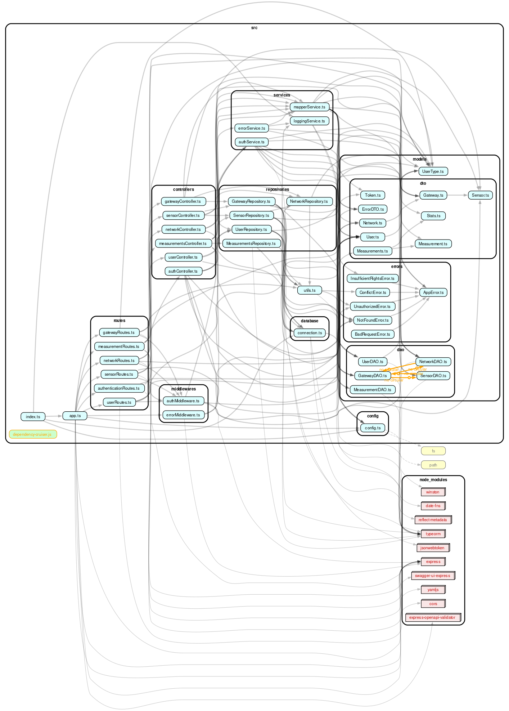
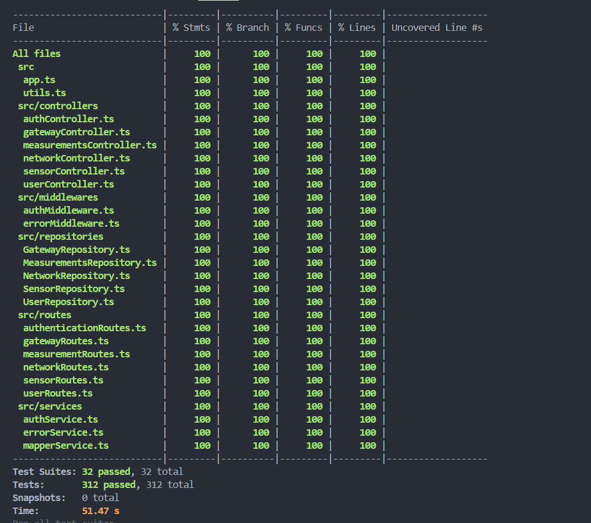

# Test Report

The goal of this document is to explain how the GeoControl application was tested, detailing how the test cases were defined and what they cover.

# Contents

- [Test Report](#test-report)
- [Contents](#contents)
- [Dependency graph](#dependency-graph)
- [Integration approach](#integration-approach)
- [Tests](#tests)
- [Coverage](#coverage)
  - [Coverage of FR](#coverage-of-fr)
  - [Coverage white box](#coverage-white-box)

# Dependency graph

# Integration approach

The integration strategy followed a **bottom-up approach**, complemented by **mixed-layer testing** (combining real and mocked dependencies), and finalized with **top-down API validation** through full-stack end-to-end tests. This layered and progressive integration ensured each component was validated in isolation before being combined, making failures easier to trace and fix. At every layer, error handling and edge cases were explicitly tested. Test doubles (such as mocks and stubs) were used where appropriate to isolate components and simulate various scenarios.

All tests were implemented using the **Jest** testing framework.

#### 1. Bottom-Up Phases:

- **Step 1: Unit Testing – Utility and Low-Level Logic**

  - File: `unit/utils.test.ts`
  - Verified independent logic for parsing, error handling, and data normalization

- **Step 2: Unit Testing – Services and Repositories**

  - Files under `unit/services/` and `unit/repositories/`
  - Tested business logic (e.g., statistics, outlier detection) using mocks and stubs
  - Verified repository methods in isolation from DB logic

- **Step 3: Unit Testing – Middleware**
  - File: `unit/middlewares/authMiddleware.test.ts`
  - Tested authentication/authorization checks, token validation, and error scenarios

#### 2. Mixed Integration Phases

- **Step 4: Integration Testing – Controllers + Services (Mocked Repos)**

  - Files: `integration/controllers/*`
  - Connected real controller logic with mocked service/repo layers
  - Verified control flow, response composition, and error handling

- **Step 5: Integration Testing – Routes + Controllers + Services**
  - Files: `integration/routes/*`
  - Tested full path from HTTP route handler to controller, with some mocks to isolate DB interaction
  - Covered both success and failure scenarios

#### 3. Top-Down Testing

- **Step 6: End-to-End Testing – Full Stack**
  - Files: `e2e/**`
  - Simulated real-world API usage over HTTP
  - Validated the entire stack:
    - Route → Controller → Service → Repository → DB
  - Verified real data flows, token-based access, error handling, and API contract compliance (based on Swagger)

---

# Tests

## End-to-End Tests

### Gateway Tests
| Test case name                     | Object(s) tested         | Test level | Technique used       |
|------------------------------------|--------------------------|------------|----------------------|
| gateways.e2e.test.ts              | Gateway API endpoints    | E2E/API    | BB/Equivalence Partitioning|

### Measurement Tests
| Test case name                     | Object(s) tested         | Test level | Technique used       |
|------------------------------------|--------------------------|------------|----------------------|
| measurements.e2e.test.ts          | Measurement API endpoints| E2E/API    | BB/Equivalence Partitioning|

### Network Tests
| Test case name                     | Object(s) tested         | Test level | Technique used       |
|------------------------------------|--------------------------|------------|----------------------|
| networks.e2e.test.ts              | Network API endpoints    | E2E/API    | BB/Equivalence Partitioning|

### Sensor Tests
| Test case name                     | Object(s) tested         | Test level | Technique used       |
|------------------------------------|--------------------------|------------|----------------------|
| sensors.e2e.test.ts               | Sensor API endpoints     | E2E/API    | BB/Equivalence Partitioning|

### User Tests
| Test case name                     | Object(s) tested         | Test level | Technique used       |
|------------------------------------|--------------------------|------------|----------------------|
| users.e2e.test.ts                 | User API endpoints       | E2E/API    | BB/Equivalence Partitioning|

## Integration Tests

### Controller-Service Integration
| Test case name                     | Object(s) tested         | Test level | Technique used       |
|------------------------------------|--------------------------|------------|----------------------|
| authController.integration.test.ts | Authentication logic     | Integration| WB/Statement Coverage|
| gatewayController.integration.test.ts | Gateway logic          | Integration| WB/Branch Coverage   |
| measurementController.integration.test.ts | Measurement logic  | Integration| WB/Statement Coverage|
| networkController.integration.test.ts | Network logic          | Integration| WB/Branch Coverage   |
| sensorController.integration.test.ts | Sensor logic           | Integration| WB/Statement Coverage|
| userController.integration.test.ts | User logic              | Integration| WB/Branch Coverage   |

### Route-Controller-Service Integration
| Test case name                     | Object(s) tested         | Test level | Technique used       |
|------------------------------------|--------------------------|------------|----------------------|
| authenticationRoutes.integration.test.ts | Authentication routes | Integration| WB/Path Coverage     |
| gatewayRoutes.integration.test.ts | Gateway routes           | Integration| WB/Statement Coverage|
| measurementRoutes.integration.test.ts | Measurement routes     | Integration| WB/Path Coverage     |
| networkRoutes.integration.test.ts | Network routes           | Integration| WB/Statement Coverage|
| sensorRoutes.integration.test.ts  | Sensor routes            | Integration| WB/Path Coverage     |
| userRoutes.integration.test.ts    | User routes              | Integration| WB/Statement Coverage|

## Unit Tests

### Middleware
| Test case name                     | Object(s) tested         | Test level | Technique used       |
|------------------------------------|--------------------------|------------|----------------------|
| authMiddleware.test.ts            | Auth middleware logic    | Unit       | WB/Path Coverage     |

### Repository Tests
| Test case name                     | Object(s) tested         | Test level | Technique used       |
|------------------------------------|--------------------------|------------|----------------------|
| GatewayRepository.db.test.ts      | Gateway repository logic | Unit       | WB/Statement Coverage|
| GatewayRepository.mock.test.ts    | Mocked gateway repository| Unit       | WB/Statement Coverage|
| MeasurementRepository.db.test.ts  | Measurement repository logic | Unit   | WB/Statement Coverage|
| MeasurementRepository.mock.test.ts| Mocked measurement repository | Unit   | WB/Statement Coverage|
| NetworkRepository.db.test.ts      | Network repository logic | Unit       | WB/Statement Coverage|
| NetworkRepository.mock.test.ts    | Mocked network repository| Unit       | WB/Statement Coverage|
| SensorRepository.db.test.ts       | Sensor repository logic  | Unit       | WB/Statement Coverage|
| SensorRepository.mock.test.ts     | Mocked sensor repository | Unit       | WB/Statement Coverage|
| UserRepository.db.test.ts         | User repository logic    | Unit       | WB/Statement Coverage|
| UserRepository.mock.test.ts       | Mocked user repository   | Unit       | WB/Statement Coverage|

### Service Tests
| Test case name                     | Object(s) tested         | Test level | Technique used       |
|------------------------------------|--------------------------|------------|----------------------|
| authService.test.ts               | Authentication service   | Unit       | WB/Path Coverage     |
| errorService.test.ts              | Error handling service   | Unit       | WB/Branch Coverage   |
| mapperService.test.ts             | Data mapping service     | Unit       | WB/Statement Coverage|

### Comprehensive Tests Table
| Test case name                                            | Object(s) tested | Test level | Technique used |
| :-------------------------------------------------------: | :--------------: | :--------: | :------------: |
| get all user (e2e)                                        | User API         | system     | BB             |
| create user (e2e)                                         | User API         | system     | BB             |
| get user by username (e2e)                                | User API         | system     | BB             |
| delete user (e2e)                                         | User API         | system     | BB             |
| should create, get, update, and delete a network (e2e)    | Network API      | system     | BB             |
| should create, get, update, and delete a gateway (e2e)    | Gateway API      | system     | BB             |
| should create, get, update, and delete a sensor (e2e)     | Sensor API       | system     | BB             |
| should record and get measurements, stats, outliers (e2e) | Measurement API  | system     | BB             |
| getToken - success                                        | authController   | integration| BB-eqp         |
| getToken - invalid password                               | authController   | integration| BB-eqp         |
| getGatewaysByNetwork                                      | gatewayController| integration| BB-eqp         |
| getGatewayByMac                                           | gatewayController| integration| BB-eqp         |
| createGateway                                             | gatewayController| integration| BB-eqp         |
| updateGateway                                             | gatewayController| integration| BB-eqp         |
| deleteGateway                                             | gatewayController| integration| BB-eqp         |
| recordMeasurement                                         | measurementController| integration| BB-eqp         |
| getMeasurementsBySensor                                   | measurementController| integration| BB-eqp         |
| getStatisticsBySensor                                     | measurementController| integration| BB-eqp         |
| getOutliersBySensor                                       | measurementController| integration| BB-eqp         |
| getMeasurementsByNetwork                                  | measurementController| integration| BB-eqp         |
| getStatisticsByNetwork                                    | measurementController| integration| BB-eqp         |
| getOutliersByNetwork                                      | measurementController| integration| BB-eqp         |

### End-to-End Testing
| Test case name                                            | Object(s) tested | Test level | Technique used |
| :-------------------------------------------------------: | :--------------: | :--------: | :------------: |
| get all user (e2e)                                        | User API         | system     | BB             |
| create user (e2e)                                         | User API         | system     | BB             |
| get user by username (e2e)                                | User API         | system     | BB             |
| delete user (e2e)                                         | User API         | system     | BB             |
| should create, get, update, and delete a network (e2e)    | Network API      | system     | BB             |
| should create, get, update, and delete a gateway (e2e)    | Gateway API      | system     | BB             |
| should create, get, update, and delete a sensor (e2e)     | Sensor API       | system     | BB             |
| should record and get measurements, stats, outliers (e2e) | Measurement API  | system     | BB             |

### authController.integration.test
| Test case name                                            | Object(s) tested | Test level | Technique used |
| :-------------------------------------------------------: | :--------------: | :--------: | :------------: |
| getToken - success                                        | authController.getToken | integration | BB-eqp         |
| getToken - invalid password                               | authController.getToken | integration | BB-eqp         |

### gatewayController.integration.test
| Test case name                                            | Object(s) tested | Test level | Technique used |
| :-------------------------------------------------------: | :--------------: | :--------: | :------------: |
| getGatewaysByNetwork                                      | gatewayController.getGatewaysByNetwork | integration | BB-eqp         |
| getGatewayByMac                                           | gatewayController.getGatewayByMac | integration | BB-eqp         |
| createGateway                                             | gatewayController.createGateway | integration | BB-eqp         |
| updateGateway                                             | gatewayController.updateGateway | integration | BB-eqp         |
| deleteGateway                                             | gatewayController.deleteGateway | integration | BB-eqp         |

### measurementController.integration.test
| Test case name                                            | Object(s) tested | Test level | Technique used |
| :-------------------------------------------------------: | :--------------: | :--------: | :------------: |
| recordMeasurement                                         | measurementController.recordMeasurement | unit | BB-eqp         |
| getMeasurementsBySensor                                   | measurementController.getMeasurementsBySensor | integration | BB-eqp         |
| getStatisticsBySensor                                     | measurementController.getStatisticsBySensor | integration | BB-eqp         |
| getOutliersBySensor                                       | measurementController.getOutliersBySensor | integration | BB-eqp         |
| getMeasurementsByNetwork                                  | measurementController.getMeasurementsByNetwork | integration | BB-eqp         |
| getStatisticsByNetwork                                    | measurementController.getStatisticsByNetwork | integration | BB-eqp         |
| getOutliersByNetwork                                      | measurementController.getOutliersByNetwork | integration | BB-eqp         |

### networkController.integration.test
| Test case name                                            | Object(s) tested | Test level | Technique used |
| :-------------------------------------------------------: | :--------------: | :--------: | :------------: |
| getAllNetworks                                            | networkController.getAllNetworks | integration | BB-eqp         |
| getNetworkByCode                                          | networkController.getNetworkByCode | integration | BB-eqp         |
| createNetwork                                             | networkController.createNetwork | integration | BB-eqp         |
| updateNetwork                                             | networkController.updateNetwork | integration | BB-eqp         |
| deleteNetwork                                             | networkController.deleteNetwork | integration | BB-eqp         |

### sensorController.integration.test
| Test case name                                            | Object(s) tested | Test level | Technique used |
| :-------------------------------------------------------: | :--------------: | :--------: | :------------: |
| getSensorsByGateway                                       | sensorController.getSensorsByGateway | integration | BB-eqp         |
| getSensorByMac                                            | sensorController.getSensorByMac | integration | BB-eqp         |
| createSensor                                              | sensorController.createSensor | integration | BB-eqp         |
| updateSensor                                              | sensorController.updateSensor | integration | BB-eqp         |
| deleteSensor                                              | sensorController.deleteSensor | integration | BB-eqp         |

### userController.integration.test
| Test case name                                            | Object(s) tested | Test level | Technique used |
| :-------------------------------------------------------: | :--------------: | :--------: | :------------: |
| get User: mapperService integration                       | userController.getUser | integration | BB-eqp         |

### authenticationRoutes.integration.test
| Test case name                                      | Object(s) tested         | Test level   | Technique used |
| :-------------------------------------------------: | :---------------------: | :----------: | :------------: |
| should return 200 and a token for valid credentials | authController.getToken  | integration  | BB-eqp         |
| should return 400 if request body is invalid        | authController.getToken  | integration  | BB-eqp         |
| should return 401 for invalid credentials           | authController.getToken  | integration  | BB-eqp         |
| should return 404 for user not found                | authController.getToken  | integration  | BB-eqp         |
| should return 500 on unexpected error               | authController.getToken  | integration  | BB-eqp         |

### gatewayRoutes.integration.test
| Test case name                                            | Object(s) tested | Test level | Technique used |
| :-------------------------------------------------------: | :--------------: | :--------: | :------------: |
| get all gateways by network                               | authService.processToken, gatewayController.getGatewaysByNetwork     | integration | BB-eqp |
| get gateway by mac                                       | authService.processToken, gatewayController.getGatewayByMac          | integration | BB-eqp |
| create gateway                                           | authService.processToken, gatewayController.createGateway            | integration | BB-eqp |
| update gateway                                           | authService.processToken, gatewayController.updateGateway            | integration | BB-eqp |
| delete gateway                                           | authService.processToken, gatewayController.deleteGateway            | integration | BB-eqp |
| get all gateways: 404 Network Not Found                  | authService.processToken, gatewayController.getGatewaysByNetwork     | integration | BB-eqp |
| create gateway: 404 Network Not Found                    | authService.processToken, gatewayController.createGateway            | integration | BB-eqp |
| get all gateways: 401 UnauthorizedError                  | authService.processToken                                           | integration | BB-eqp |
| get all gateways: 403 InsufficientRightsError            | authService.processToken                                           | integration | BB-eqp |
| get all gateways: error handler                          | authService.processToken, gatewayController.getGatewaysByNetwork     | integration | BB-eqp |
| create gateway: error handler                            | authService.processToken, gatewayController.createGateway            | integration | BB-eqp |
| get gateway by mac: error handler                        | authService.processToken, gatewayController.getGatewayByMac          | integration | BB-eqp |
| update gateway: error handler                            | authService.processToken, gatewayController.updateGateway            | integration | BB-eqp |
| delete gateway: error handler                            | authService.processToken, gatewayController.deleteGateway            | integration | BB-eqp |
| create gateway: 400 BadRequest                           | authService.processToken, gatewayController.createGateway            | integration | BB-eqp |
| create gateway: 409 Conflict                             | authService.processToken, gatewayController.createGateway            | integration | BB-eqp |

### measurementRoutes.integration.test
| Test case name                                            | Object(s) tested | Test level | Technique used |
| :-------------------------------------------------------: | :--------------: | :--------: | :------------: |
| record measurement                                       | authService.processToken, measurementController.recordMeasurement | integration | BB-eqp |
| get measurements by sensor                               | authService.processToken, measurementController.getMeasurementsBySensor | integration | BB-eqp |
| get statistics by sensor                                 | authService.processToken, measurementController.getStatisticsBySensor | integration | BB-eqp |
| get outliers by sensor                                   | authService.processToken, measurementController.getOutliersBySensor | integration | BB-eqp |
| get measurements by network                              | authService.processToken, measurementController.getMeasurementsByNetwork | integration | BB-eqp |
| get statistics by network                                | authService.processToken, measurementController.getStatisticsByNetwork | integration | BB-eqp |
| get outliers by network                                  | authService.processToken, measurementController.getOutliersByNetwork | integration | BB-eqp |
| record measurement: 401 UnauthorizedError                | authService.processToken                                           | integration | BB-eqp |
| record measurement: 403 InsufficientRightsError          | authService.processToken                                           | integration | BB-eqp |
| record measurement: error handler                        | authService.processToken, measurementController.recordMeasurement | integration | BB-eqp |
| get measurements by sensor: error handler                | authService.processToken, measurementController.getMeasurementsBySensor | integration | BB-eqp |
| get statistics by sensor: error handler                  | authService.processToken, measurementController.getStatisticsBySensor | integration | BB-eqp |
| get outliers by sensor: error handler                    | authService.processToken, measurementController.getOutliersBySensor | integration | BB-eqp |
| get measurements by network: error handler               | authService.processToken, measurementController.getMeasurementsByNetwork | integration | BB-eqp |
| get statistics by network: error handler                 | authService.processToken, measurementController.getStatisticsByNetwork | integration | BB-eqp |
| get outliers by network: error handler                   | authService.processToken, measurementController.getOutliersByNetwork | integration | BB-eqp |
| record measurement: 400 BadRequest                       | authService.processToken, measurementController.recordMeasurement | integration | BB-eqp |
| record measurement: 404 NotFound                         | authService.processToken, measurementController.recordMeasurement | integration | BB-eqp |
| record measurement: 409 Conflict                         | authService.processToken, measurementController.recordMeasurement | integration | BB-eqp |
| get measurements by sensor: 400 BadRequest               | authService.processToken, measurementController.getMeasurementsBySensor | integration | BB-eqp |
| get measurements by sensor: 404 NotFound                 | authService.processToken, measurementController.getMeasurementsBySensor | integration | BB-eqp |
| get measurements by sensor: 409 Conflict                 | authService.processToken, measurementController.getMeasurementsBySensor | integration | BB-eqp |
| get statistics by sensor: 404 NotFound                   | authService.processToken, measurementController.getStatisticsBySensor | integration | BB-eqp |
| get outliers by sensor: 404 NotFound                     | authService.processToken, measurementController.getOutliersBySensor | integration | BB-eqp |
| get measurements by network: 404 NotFound                | authService.processToken, measurementController.getMeasurementsByNetwork | integration | BB-eqp |
| get statistics by network: 404 NotFound                  | authService.processToken, measurementController.getStatisticsByNetwork | integration | BB-eqp |
| get outliers by network: 404 NotFound                    | authService.processToken, measurementController.getOutliersByNetwork | integration | BB-eqp |

### networkRoutes.integration.test
| Test case name                                            | Object(s) tested | Test level | Technique used |
| :-------------------------------------------------------: | :--------------: | :--------: | :------------: |
| get all networks | authService.processToken, networkController.getAllNetworks | integration | BB-eqp |
| get network by code | authService.processToken, networkController.getNetworkByCode | integration | BB-eqp |
| create network | authService.processToken, networkController.createNetwork | integration | BB-eqp |
| update network | authService.processToken, networkController.updateNetwork | integration | BB-eqp |
| delete network | authService.processToken, networkController.deleteNetwork | integration | BB-eqp |
| get all networks: 401 UnauthorizedError | authService.processToken | integration | BB-eqp |
| get all networks: 403 InsufficientRightsError | authService.processToken | integration | BB-eqp |
| get all networks: error handler | authService.processToken, networkController.getAllNetworks | integration | BB-eqp |
| create network: error handler | authService.processToken, networkController.createNetwork | integration | BB-eqp |
| get network by code: error handler | authService.processToken, networkController.getNetworkByCode | integration | BB-eqp |
| update network: error handler | authService.processToken, networkController.updateNetwork | integration | BB-eqp |
| delete network: error handler | authService.processToken, networkController.deleteNetwork | integration | BB-eqp |
| get network by code: 400 BadRequest | authService.processToken, networkController.getNetworkByCode | integration | BB-eqp |
| get network by code: 401 Unauthorized | authService.processToken | integration | BB-eqp |
| get network by code: 403 Forbidden | authService.processToken | integration | BB-eqp |
| get network by code: 404 NotFound | authService.processToken, networkController.getNetworkByCode | integration | BB-eqp |
| get network by code: 409 Conflict | authService.processToken, networkController.getNetworkByCode | integration | BB-eqp |
| get network by code: 500 InternalServerError | authService.processToken, networkController.getNetworkByCode | integration | BB-eqp |

### sensorRoutes.integration.test
| Test case name                                            | Object(s) tested | Test level | Technique used |
| :-------------------------------------------------------: | :--------------: | :--------: | :------------: |
| get all sensors by gateway | authService.processToken, sensorController.getSensorsByGateway | integration | BB-eqp |
| get sensor by mac | authService.processToken, sensorController.getSensorByMac | integration | BB-eqp |
| create sensor | authService.processToken, sensorController.createSensor | integration | BB-eqp |
| update sensor | authService.processToken, sensorController.updateSensor | integration | BB-eqp |
| delete sensor | authService.processToken, sensorController.deleteSensor | integration | BB-eqp |
| get all sensors: 401 UnauthorizedError | authService.processToken | integration | BB-eqp |
| get all sensors: 403 InsufficientRightsError | authService.processToken | integration | BB-eqp |
| get all sensors: error handler | authService.processToken, sensorController.getSensorsByGateway | integration | BB-eqp |
| create sensor: error handler | authService.processToken, sensorController.createSensor | integration | BB-eqp |
| get sensor by mac: error handler | authService.processToken, sensorController.getSensorByMac | integration | BB-eqp |
| update sensor: error handler | authService.processToken, sensorController.updateSensor | integration | BB-eqp |
| delete sensor: error handler | authService.processToken, sensorController.deleteSensor | integration | BB-eqp |
| get all sensors: 400 BadRequest | authService.processToken, sensorController.getSensorsByGateway | integration | BB-eqp |
| get all sensors: 404 NotFound | authService.processToken, sensorController.getSensorsByGateway | integration | BB-eqp |
| get all sensors: 409 Conflict | authService.processToken, sensorController.getSensorsByGateway | integration | BB-eqp |
| create sensor: 400 BadRequest | authService.processToken, sensorController.createSensor | integration | BB-eqp |
| create sensor: 404 NotFound | authService.processToken, sensorController.createSensor | integration | BB-eqp |
| create sensor: 409 Conflict | authService.processToken, sensorController.createSensor | integration | BB-eqp |
| get sensor by mac: 404 NotFound | authService.processToken, sensorController.getSensorByMac | integration | BB-eqp |
| update sensor: 404 NotFound | authService.processToken, sensorController.updateSensor | integration | BB-eqp |
| delete sensor: 404 NotFound | authService.processToken, sensorController.deleteSensor | integration | BB-eqp |

### userRoutes.integration.test
| Test case name                                            | Object(s) tested | Test level | Technique used |
| :-------------------------------------------------------: | :--------------: | :--------: | :------------: |
| get all users | authService.processToken, userController.getAllUsers | integration | BB-eqp |
| get all users: 401 UnauthorizedError | authService.processToken | integration | BB-eqp |
| get all users: 403 InsufficientRightsError | authService.processToken | integration | BB-eqp |
| get all users: 500 error handler | authService.processToken, userController.getAllUsers | integration | BB-eqp |
| create user: 201 Created | authService.processToken, userController.createUser | integration | BB-eqp |
| create user: 400 BadRequest | authService.processToken | integration | BB-eqp |
| create user: 401 UnauthorizedError | authService.processToken | integration | BB-eqp |
| create user: 403 InsufficientRightsError | authService.processToken | integration | BB-eqp |
| create user: 409 Conflict | authService.processToken, userController.createUser | integration | BB-eqp |
| create user: 500 error handler | authService.processToken, userController.createUser | integration | BB-eqp |
| delete user: 204 No Content | authService.processToken, userController.deleteUser | integration | BB-eqp |
| delete user: 401 UnauthorizedError | authService.processToken | integration | BB-eqp |
| delete user: 403 InsufficientRightsError | authService.processToken | integration | BB-eqp |
| delete user: 404 NotFound | authService.processToken, userController.deleteUser | integration | BB-eqp |
| delete user: 500 error handler | authService.processToken, userController.deleteUser | integration | BB-eqp |

### GatewayRepository.test
| Test case name                                            | Object(s) tested | Test level | Technique used |
| :-------------------------------------------------------: | :--------------: | :--------: | :------------: |
| create gateway | GatewayRepository.createGateway | unit | BB-eqp |
| find gateway by macAddress: not found | GatewayRepository.getGatewayByMacAddress | unit | BB-eqp |
| create gateway: conflict | GatewayRepository.createGateway | unit | BB-eqp |
| update gateway | GatewayRepository.updateGateway | unit | BB-eqp |
| create gateway: network not found | GatewayRepository.createGateway | unit | BB-eqp |
| update gateway: network not found | GatewayRepository.updateGateway | unit | BB-eqp |

### MeasurementRepository.test
| Test case name                                            | Object(s) tested | Test level | Technique used |
| :-------------------------------------------------------: | :--------------: | :--------: | :------------: |
| create, get, statistics, outliers | MeasurementRepository.createMeasurement, MeasurementRepository.getMeasurements, MeasurementRepository.getStatistics, MeasurementRepository.getOutliers | unit | BB-eqp |
| createMeasurement - sensor not found | MeasurementRepository.createMeasurement | unit | BB-eqp |
| getStatistics - no data | MeasurementRepository.getStatistics | unit | BB-eqp |
| getMeasurementsByNetwork, getStatisticsByNetwork, getOutliersByNetwork | MeasurementRepository.getMeasurementsByNetwork, MeasurementRepository.getStatisticsByNetwork, MeasurementRepository.getOutliersByNetwork | unit | BB-eqp |
| getMeasurements - with date filters | MeasurementRepository.getMeasurements | unit | BB-eqp |
| getOutliers - no outliers | MeasurementRepository.getOutliers | unit | BB-eqp |
| getOutliers - with outlier | MeasurementRepository.getOutliers | unit | BB-eqp |
| getMeasurementsByNetwork - with date filters | MeasurementRepository.getMeasurementsByNetwork | unit | BB-eqp |
| getStatisticsByNetwork - no data | MeasurementRepository.getStatisticsByNetwork | unit | BB-eqp |
| getOutliersByNetwork - no data | MeasurementRepository.getOutliersByNetwork | unit | BB-eqp |
| getStatistics - throws if no measurements | MeasurementRepository.getStatistics | unit | BB-eqp |
| getOutliers - throws if no measurements | MeasurementRepository.getOutliers | unit | BB-eqp |
| getStatistics includes startDate and endDate fields | MeasurementRepository.getStatistics | unit | BB-eqp |
| getStatisticsByNetwork includes startDate and endDate fields | MeasurementRepository.getStatisticsByNetwork | unit | BB-eqp |

### NetworkRepository.test
| Test case name                                            | Object(s) tested | Test level | Technique used |
| :-------------------------------------------------------: | :--------------: | :--------: | :------------: |
| create network | NetworkRepository.createNetwork | unit | BB-eqp |
| find network by code: not found | NetworkRepository.getNetworkByNetworkCode | unit | BB-eqp |
| create network: conflict | NetworkRepository.createNetwork | unit | BB-eqp |
| update network | NetworkRepository.updateNetwork | unit | BB-eqp |
| update network: not found | NetworkRepository.updateNetwork | unit | BB-eqp |
| getAllNetworks | NetworkRepository.getAllNetworks | unit | BB-eqp |
| delete network: not found | NetworkRepository.deleteNetwork | unit | BB-eqp |

### SensorRepository.test
| Test case name                                            | Object(s) tested | Test level | Technique used |
| :-------------------------------------------------------: | :--------------: | :--------: | :------------: |
| create, get, update, delete sensor | SensorRepository.createSensor, SensorRepository.getSensorByMacAddress, SensorRepository.updateSensor, SensorRepository.deleteSensor | unit | BB-eqp |
| createSensor - conflict | SensorRepository.createSensor | unit | BB-eqp |
| getSensorByMacAddress - not found | SensorRepository.getSensorByMacAddress | unit | BB-eqp |
| updateSensor - not found | SensorRepository.updateSensor | unit | BB-eqp |
| deleteSensor - not found | SensorRepository.deleteSensor | unit | BB-eqp |

### UserRepository.test
| Test case name                                            | Object(s) tested | Test level | Technique used |
| :-------------------------------------------------------: | :--------------: | :--------: | :------------: |
| create user | UserRepository.createUser | unit | BB-eqp |
| find user by username: not found | UserRepository.getUserByUsername | unit | BB-eqp |
| create user: conflict | UserRepository.createUser | unit | BB-eqp |
| getAllUsers | UserRepository.getAllUsers | unit | BB-eqp |
| delete User: not found | UserRepository.deleteUser | unit | BB-eqp |

### AuthService.test
| Test case name                                            | Object(s) tested | Test level | Technique used |
| :-------------------------------------------------------: | :--------------: | :--------: | :------------: |
| should generate a JWT token | authService.generateToken | unit | BB-eqp |
| work without role restriction | authService.processToken | unit | BB-eqp |
| work if user has allowed role | authService.processToken | unit | BB-eqp |
| throw if user has unauthorized role | authService.processToken | unit | BB-eqp |
| throw if user is not found | authService.processToken | unit | BB-eqp |
| throw if token is missing | authService.processToken | unit | BB-eqp |
| throw if token is malformed | authService.processToken | unit | BB-eqp |
| throw UnauthorizedError if jwt.verify fails with generic error | authService.processToken | unit | BB-eqp |
| rethrow existing AppError (UnauthorizedError) | authService.processToken | unit | BB-eqp |
| should allow access when allowedRoles is empty | authService.processToken | unit | BB-eqp |
| should allow access when user type is in allowedRoles | authService.processToken | unit | BB-eqp |
| should reject access when user type is not in allowedRoles | authService.processToken | unit | BB-eqp |
| should allow access when allowedRoles is omitted | authService.processToken | unit | BB-eqp |

### ErrorService.test
| Test case name                                            | Object(s) tested | Test level | Technique used |
| :-------------------------------------------------------: | :--------------: | :--------: | :------------: |
| should handle a generic error | errorService.createAppError | unit | BB-eqp |
| should handle an error without message | errorService.createAppError | unit | BB-eqp |
| should handle an AppError | errorService.createAppError | unit | BB-eqp |
| should handle an error with status (non-AppError) | errorService.createAppError | unit | BB-eqp |

### mapperService.test
| Test case name                                            | Object(s) tested | Test level | Technique used |
| :-------------------------------------------------------: | :--------------: | :--------: | :------------: |
| should return a token dto with token | mapperService.createTokenDTO | unit | BB-eqp |
| should remove undefined token | mapperService.createTokenDTO | unit | BB-eqp |
| should return full user dto with all fields | mapperService.createUserDTO | unit | BB-eqp |
| should remove password if undefined | mapperService.createUserDTO | unit | BB-eqp |
| should remove password if null | mapperService.createUserDTO | unit | BB-eqp |
| should map UserDAO to DTO | mapperService.mapUserDAOToDTO | unit | BB-eqp |
| should include all non-null fields | mapperService.createErrorDTO | unit | BB-eqp |
| should exclude null fields | mapperService.createErrorDTO | unit | BB-eqp |
| should exclude undefined fields | mapperService.createErrorDTO | unit | BB-eqp |
| should exclude fields with empty arrays | mapperService.removeNullAttributes | unit | BB-eqp |

### measurementService.test
| Test case name                                            | Object(s) tested | Test level | Technique used |
| :-------------------------------------------------------: | :--------------: | :--------: | :------------: |
| calls getStatistics on the repository | measurementService.getStatistics | unit | BB-eqp |
| calls getOutliers on the repository | measurementService.getOutliers | unit | BB-eqp |
# Coverage

## Coverage of FR

| Functional Requirement            | Test(s)                                                  |
|-----------------------------------|---------------------------------------------------------|
| FR1.1 (Login)                     | auth.e2e.test.ts, authMiddleware.test.ts, AuthController.test.ts |
| FR1.2 (Token Generation)          | auth.e2e.test.ts, authMiddleware.test.ts, AuthController.test.ts |
| FR1.3 (User Roles)                | auth.e2e.test.ts, user.e2e.test.ts, UserController.test.ts |
| FR2.1 (Retrieve Users)            | user.e2e.test.ts, userRoutes.integration.test.ts, UserController.test.ts |
| FR2.2 (Create User)               | user.e2e.test.ts, userRoutes.integration.test.ts, UserController.test.ts |
| FR2.3 (Retrieve User Details)     | user.e2e.test.ts, userRoutes.integration.test.ts, UserController.test.ts |
| FR2.4 (Delete User)               | user.e2e.test.ts, userRoutes.integration.test.ts, UserController.test.ts |
| FR3.1 (View Networks)             | Get-all-networks.e2e.test.ts, Retrieve-single-network.e2e.test.ts, NetworkController.test.ts |
| FR3.2 (Create Network)            | Create-network.e2e.test.ts, networkRoutes.integration.test.ts, NetworkController.test.ts |
| FR3.3 (View Specific Network)     | Retrieve-single-network.e2e.test.ts, networkRoutes.integration.test.ts, NetworkController.test.ts |
| FR3.4 (Update Network)            | Update-network.e2e.test.ts, networkRoutes.integration.test.ts, NetworkController.test.ts |
| FR3.5 (Delete Network)            | Delete-network.e2e.test.ts, networkRoutes.integration.test.ts, NetworkController.test.ts |
| FR4.1 (View Gateways)             | Get-all-gateways.e2e.test.ts, Retrieve-single-gateway.e2e.test.ts, GatewayController.test.ts |
| FR4.2 (Create Gateway)            | Create-gateway.e2e.test.ts, gatewayRoutes.integration.test.ts, GatewayController.test.ts |
| FR4.3 (View Specific Gateway)     | Retrieve-single-gateway.e2e.test.ts, gatewayRoutes.integration.test.ts, GatewayController.test.ts |
| FR4.4 (Update Gateway)            | Update-gateway.e2e.test.ts, gatewayRoutes.integration.test.ts, GatewayController.test.ts |
| FR4.5 (Delete Gateway)            | Delete-gateway.e2e.test.ts, gatewayRoutes.integration.test.ts, GatewayController.test.ts |
| FR5.1 (View Sensors)              | Get-all-sensors.e2e.test.ts, Retrieve-single-sensor.e2e.test.ts, SensorController.test.ts |
| FR5.2 (Add Sensor)                | Add-sensor.e2e.test.ts, sensorRoutes.integration.test.ts, SensorController.test.ts |
| FR5.3 (View Specific Sensor)      | Retrieve-single-sensor.e2e.test.ts, sensorRoutes.integration.test.ts, SensorController.test.ts |
| FR5.4 (Update Sensor)             | Update-sensor.e2e.test.ts, sensorRoutes.integration.test.ts, SensorController.test.ts |
| FR5.5 (Delete Sensor)             | Delete-sensor.e2e.test.ts, sensorRoutes.integration.test.ts, SensorController.test.ts |
| FR6.1 (Store Measurements)        | Store-measurements.e2e.test.ts, measurementRoutes.integration.test.ts, MeasurementController.test.ts |
| FR6.2 (Retrieve Measurements)     | Retrieve-measurements.e2e.test.ts, measurementRoutes.integration.test.ts, MeasurementController.test.ts |
| FR6.3 (Timestamps in UTC)         | Retrieve-measurements.e2e.test.ts, measurementRoutes.integration.test.ts, MeasurementController.test.ts |
| FR7.1 (Retrieve Sensor Stats)     | Retrieve-sensor-stats.e2e.test.ts, measurementRoutes.integration.test.ts, MeasurementController.test.ts |
| FR7.2 (Retrieve Sensor Outliers)  | Retrieve-sensor-outliers.e2e.test.ts, measurementRoutes.integration.test.ts, MeasurementController.test.ts |
| FR7.3 (Retrieve Network Stats)    | Retrieve-network-stats.e2e.test.ts, measurementRoutes.integration.test.ts, MeasurementController.test.ts |
| FR7.4 (Retrieve Network Outliers) | Retrieve-network-outliers.e2e.test.ts, measurementRoutes.integration.test.ts, MeasurementController.test.ts |
| FR7.5 (Outlier Detection Formula) | Retrieve-sensor-outliers.e2e.test.ts, measurementRoutes.integration.test.ts, MeasurementController.test.ts |

## Coverage white box

Current coverage metrics from Jest:

- Test Suites: 32 passed (32 total)
- Tests: 312 passed (312 total)
- Coverage Results:
  - Statements: 100%
  - Branches: 100%
  - Functions: 100%
  - Lines: 100%

